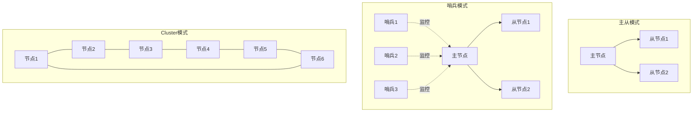
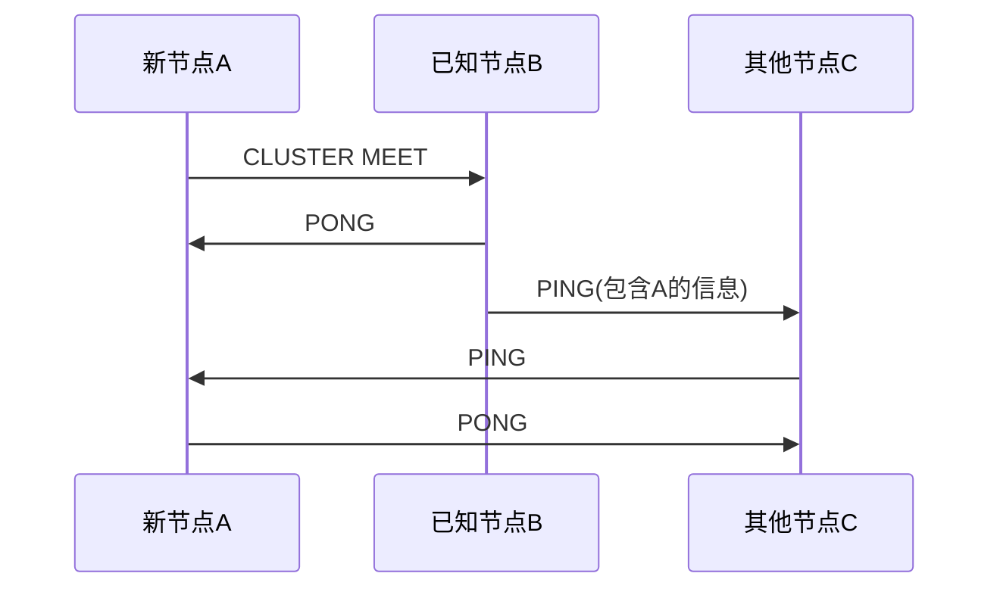
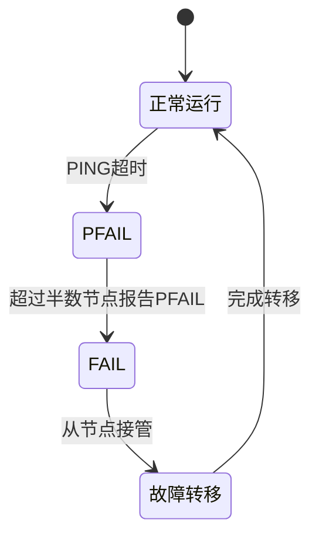
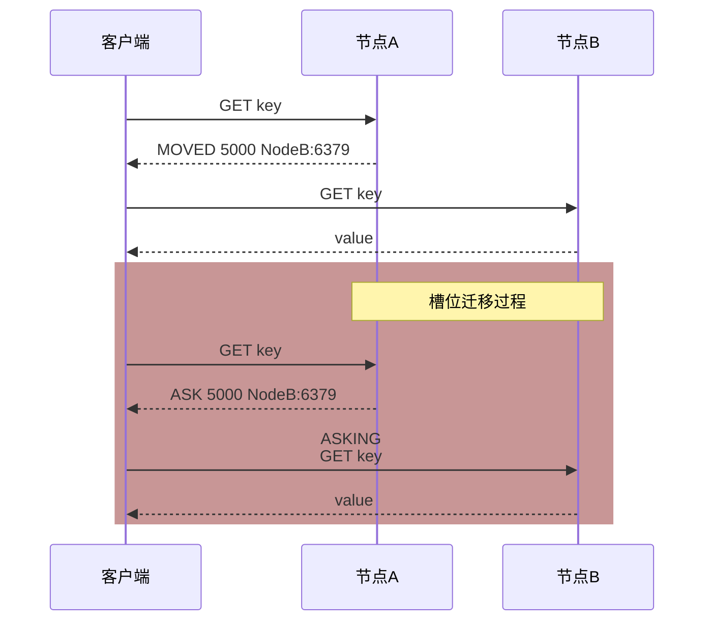
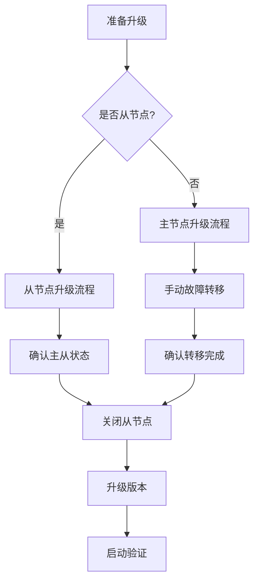

# Redis Cluster 架构详解

## 引言

Redis Cluster 是 Redis 的分布式解决方案，它提供了一种在多个 Redis 节点间分配数据的方案。本文将深入探讨 Redis Cluster 的架构设计和核心机制，并对比其与主从模式、哨兵模式的区别。我们将从运行机制、节点发现机制、故障转移等方面进行详细分析，帮助读者理解 Redis Cluster 的设计思想和应用场景。

<!--truncate-->

## 1. Redis 不同模式的对比



### 1.1 主从模式
主从模式是最简单的 Redis 架构，类似于一个小型公司：
- 一位总经理（master）负责所有决策（写操作）
- 几个部门经理（slave）负责执行和传达（读操作）
- 优点是结构简单，易于部署
- 缺点是主节点存在单点故障风险

### 1.2 哨兵模式
哨兵模式在主从模式基础上增加了一个董事会（sentinel 集群）：
- 负责监控主节点的健康状态
- 在主节点宕机时自动进行故障转移
- 提高了系统的可用性
- 仍然是中心化的架构

### 1.3 Cluster 模式
Cluster 模式像一个大型企业集团：
- 由多个相对独立的子公司组成
- 每个子公司负责自己的业务范围（slot 范围）
- 具有高可用性、可扩展性和去中心化的特点

## 2. 核心特性

### 2.1 数据分片

```ascii
+----------------+  CRC16   +-------------------------+
|     Key        | -------> |     16384 slots        |
+----------------+          |   +---+---+---+---+     |
                           |   | 0 | 1 | 2 |...| 16383|
                           |   +---+---+---+---+     |
                           +-------------------------+
                                     |
                                     v
                           +-------------------------+
                           |      Node1  Node2  Node3|
                           | slots: 0-5461 5462-10922|
                           |       10923-16383       |
                           +-------------------------+
```

- 使用 16384 个槽位（slot）进行数据分片
- 每个节点负责一部分槽位
- 通过 CRC16 算法计算 key 属于哪个槽位
- 支持动态扩展和收缩
- 槽位设计的优势：
  - 减少元数据存储：16384 个槽只需要 2KB 内存表示所有槽的分配信息
  - 平衡性更好：槽是可以精确均分的，避免传统一致性哈希的数据倾斜问题

### 2.2 节点发现机制
Redis Cluster 的节点发现机制分为两种场景：

1. **创建新集群**：
   - 使用 `redis-cli --cluster create 192.168.1.10:6379 192.168.1.11:6379 192.168.1.12:6379` 命令
   - 为每个节点分配唯一的 Node ID
   - 建立节点间的初始连接
   - 分配槽位
   - 配置主从关系（如果需要）

2. **加入已存在的集群**：
   - 使用 `cluster meet` 命令
   - 新节点只需要知道一个集群成员的地址
   - 通过 Gossip 协议传播节点信息



### 2.3 故障检测机制
Redis Cluster 采用去中心化的故障检测机制：

1. **检测流程**：
   - 节点间通过心跳检测（PING/PONG）
   - 超时未响应标记为 PFAIL（可能下线）
   - 超过半数节点认为 PFAIL 时升级为 FAIL
   - 每个节点维护一个故障检测表，记录其他节点的状态

2. **故障转移**：
   - 从节点自动接管故障主节点
   - 使用配置纪元（configuration epoch）确保配置一致性
   - 不需要中心化的协调者



## 3. 重定向和槽迁移

### 3.1 请求重定向
Redis Cluster 使用两种重定向机制：

1. **MOVED 重定向**：
   - 适用于槽位固定分配的情况
   - 客户端可以缓存槽位映射信息
   - 类似于图书馆的固定书架编号

2. **ASK 重定向**：
   - 用于槽位迁移过程中
   - 客户端需要带 ASKING 标记访问目标节点
   - 类似于图书正在搬运中的临时位置指引



### 3.2 槽位迁移过程
迁移过程精心设计，确保服务不中断：

1. **准备阶段**：
   - 源节点标记槽位为 MIGRATING
   - 目标节点标记槽位为 IMPORTING
   - 类似于图书馆搬运前的标记

2. **数据迁移**：
   - 批量获取和迁移 key
   - 保持源节点和目标节点都可用
   - 使用 ASK 重定向处理请求
   - 类似于图书馆分批搬运书籍

3. **完成阶段**：
   - 更新集群槽位映射
   - 清除迁移标记
   - 通知所有节点
   - 类似于图书馆更新书架索引

## 4. 网络通信

### 4.1 双端口通信
Redis Cluster 节点间使用两个 TCP 端口：

1. **客户端端口**（默认 6379）：
   - 处理客户端请求
   - 数据操作命令

2. **集群总线端口**（默认 16379）：
   - 节点间心跳检测
   - 配置更新
   - 故障检测
   - 故障转移投票

```ascii
Node A (6379)                 Node B (6379)
    |                            |
    |        Client Port         |
    | <-----------------------> |
    |                            |
    |      Cluster Bus Port      |
    | <-----------------------> |
    |         (16379)            |
    |                            |
    v                            v
```

### 4.2 网络分区处理
- 采用少数服从多数原则
- 要求半数以上主节点能通信
- 至少需要一个从节点在线
- 倾向于保证一致性（C）而非可用性（A）

## 5. 运维管理

### 5.1 版本升级
滚动升级流程：

1. **从节点升级**：
   ```bash
   # 1. 确认主从状态
   redis-cli -h slave_host -p slave_port info replication

   # 2. 优雅关闭从节点
   redis-cli -h slave_host -p slave_port shutdown save

   # 3. 升级软件版本

   # 4. 启动新版本
   systemctl start redis

   # 5. 验证从节点同步状态
   redis-cli -h slave_host -p slave_port info replication
   ```

2. **主节点升级**：
   ```bash
   # 1. 手动故障转移到从节点
   redis-cli -h master_host -p master_port cluster failover

   # 2. 确认故障转移完成
   redis-cli cluster nodes

   # 3. 按照从节点的步骤进行升级
   ```



### 5.2 关键注意事项
- **数据一致性保护**：
  - 每次关闭节点前使用 SAVE 命令确保数据持久化
  - 升级后检查 AOF 和 RDB 文件的完整性
- **版本兼容性验证**：
  - 确认新旧版本的集群协议是否兼容
  - 验证客户端是否支持新版本
- **监控指标**：
  - 节点状态和角色
  - 槽位分配情况
  - 复制延迟
  - 网络连接状态
  - 内存使用情况
  - 请求响应时间
- **故障应对预案**：
  - 准备回滚脚本
  - 保留旧版本的配置文件和二进制文件
  - 记录每个步骤的操作日志

### 5.3 升级验证
```bash
# 1. 版本确认
redis-cli info server | grep version

# 2. 复制状态
redis-cli info replication

# 3. 集群状态
redis-cli cluster info

# 4. 数据一致性检查
redis-cli --cluster check host:port
```

## 6. 选择合适的模式

在选择 Redis 模式时，需要考虑以下因素：

- 数据量预计会增长到什么规模？
- 系统需要处理的并发量有多大？
- 是否需要在多个数据中心部署？
- 对数据一致性的要求有多高？

从领域模型的角度来看：
- **主从模式**：中心化、单点写入的简单架构
- **哨兵模式**：引入监控和自动故障转移的高可用架构
- **Cluster 模式**：分布式、去中心化的可扩展架构

## 总结

Redis Cluster 通过精心的架构设计，实现了可扩展、高可用的分布式缓存系统。它的去中心化设计、数据分片机制、故障检测和处理机制等特性，使其能够满足大规模分布式系统的需求。通过本文的深入分析，我们不仅理解了 Redis Cluster 的核心机制，还了解了如何正确地运维和管理集群。在实际应用中，需要根据具体场景选择合适的 Redis 模式，并做好相应的运维规划。
